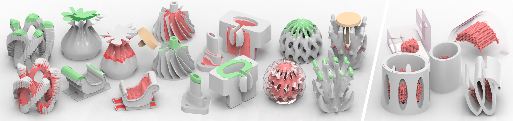

# DeepMill: Neural Accessibility Learning for Subtractive Manufacturing


<!-- [**DeepMill: Neural Accessibility Learning for Subtractive Manufacturing**](https://dl.acm.org/doi/10.1145/3618317) -->
[**DeepMill: Neural Accessibility Learning for Subtractive Manufacturing**](https://arxiv.org/abs/2309.05613) <br/>
[Fanchao Zhong](https://fanchao98.github.io/), [Yang Wang](https://chfaithwy.github.io/), [Peng-Shuai Wang](https://wang-ps.github.io/), [Lin Lu](https://irc.cs.sdu.edu.cn/~lulin/index.html), and [Haisen Zhao](https://haisenzhao.github.io/) <br/>
ACM SIGGRAPH 2025 (conference track)



- [DeepMill: Neural Accessibility Learning for Subtractive Manufacturing](#)
  - [1. Environment Configuration](#1-environment-configuration)
  - [2. Prepare Data](#2-prepare-data)
  - [3. Train](#3-train)
  - [4. Test](#4-test)
  - [5. Citation](#5-citation)


## 1. Environment Configuration

(1) please install pytorch that fits your cuda version.


(2) install the packages required by DeepMill:

```
pip3 install -r requirements.txt
```

## 2. Prepare Data

To prepare the dataset, first store the accessibility results computed by traditional collision detection methods in the folder `DeepMill/projects/data/raw_data`. 
Assuming the subfolder is named `models`, place all accessibility data of the 3D models in `DeepMill/projects/data/raw_data/models`, where each `.txt` file corresponds to a single 3D model.
Each line in the file contains 8 values representing a sampled point: 3D coordinates (X, Y, Z), surface normals (XN, YN, ZN), and two binary labels indicating whether the point is unreachable or occluded. 
Additionally, the tool sizes used for each 3D model should be stored in `DeepMill/projects/data/raw_data/models_cutter`, with each `.txt` file containing four parameters that define the tool's shape. 
We provide part of the data we used in `data/raw_data`. If you haven't installed Git LFS, please download `data.zip`(568M) separately by clicking on it in GitHub.

Once the data is in place, run the following command to preprocess the dataset:
```
python projects/tools/seg_deepmill_cutter.py
```
If successful, the script will create two new folders, `filelist` and `points`, in `DeepMill/projects/data`.


## 3. Train

Run the following command to train the network:

```
python scripts/run_seg_deepmill.py --depth 5 --model unet --alias unet_d5
```
The dataset will be randomly split into a training set and a test set.

Run the following command to visualize the training and testing process:
```
tensorboard --logdir .\DeepMill\projects\logs
```

A checkpoint of our model is provided in `pretrained/00840solver.zip`(154M). Note that if you haven't installed Git LFS, please download `00840solver.zip` separately by clicking on it in GitHub.

## 4. Test

Open the `seg_deepmill.yaml` file in `DeepMill\projects\configs`, and change `run: train` to `run: test` to perform testing only.

In `DeepMill\projects\data\vis`, you can view the accessible points predicted by DeepMill for the 3D models in the test set.


This will open a polyscope window and show the results.

## 5. Citation

If you find this project useful for your research, please kindly cite our paper:

```bibtex
@article{zhong2025deepmill,
  title={DeepMill: Neural Accessibility Learning for Subtractive Manufacturing},
  author={Zhong, Fanchao and Wang, Yang and Wang, Peng-Shuai and Lu, Lin and Zhao, Haisen},
  journal={arXiv preprint arXiv:2502.06093},
  year={2025}
}
```

Feel free to drop us a message at *fanchaoz98@gmail.com* if you have any questions!
